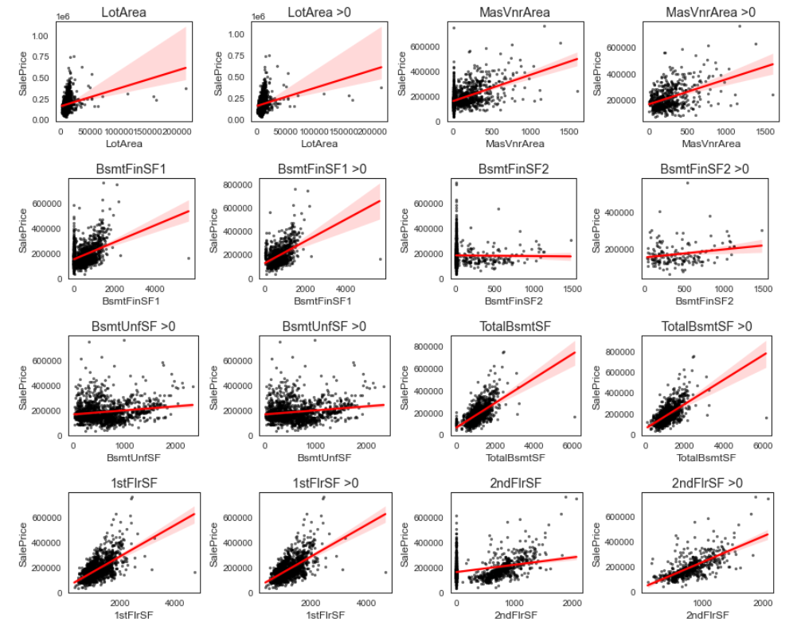

# Portfolio (in maintenance until 18 March 21.00 WIB)
---
## Data Science

### Regression - House Prices

When buying a house, customers usually have considerations about things like presence of garage, number of bedroom, number of floor, and the age of the house. In this occasion, we are given The Ames Housing dataset complied by Dean De Cock and provided by Kaggle. This dataset talks about many variables of house from the count into its variable area. Our objective is to predict the sales price for each house.

We use many regression algorithms to build the model for this case. From what we worked on, the results stated that The XGBoost makes the best prediction with score 0.14363 followed by Ridge Regression with 0.16462, Lasso Regression with 0.18133, and Linear Regression with 0.19303. Improvement still can be make by adding target-encoding to high cardinality variables, apply cross-validation (CV), and more deeper EDA.

Top 40% in Kaggle

---
### Classification - Spaceship Titanic

axaxa.

---
## Convolutional Neural Networks (CNN)

### MNIST Digit Recognizer with TensorFlow

abcd.

 

 

---
### CIFAR-10 Image Classification using VGG16 and ResNet50 with TensorFlow

absc

 

 

---

© 203 vsve. Powered by Jekyll and the Minimal Theme.

