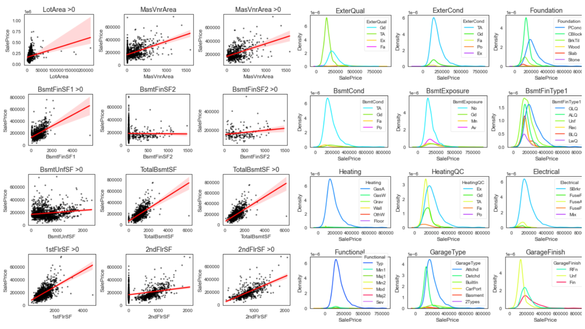
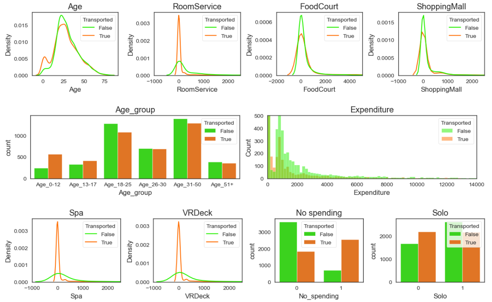
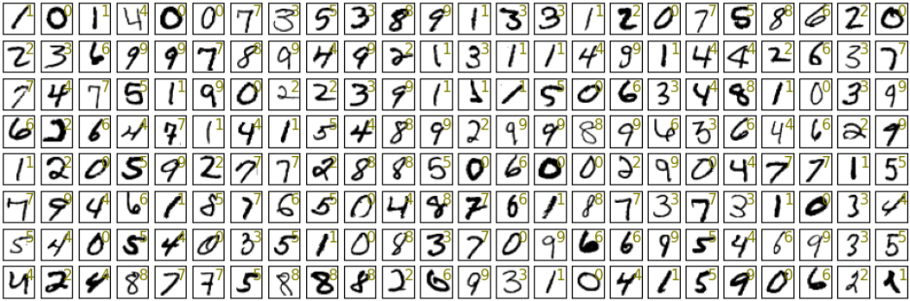
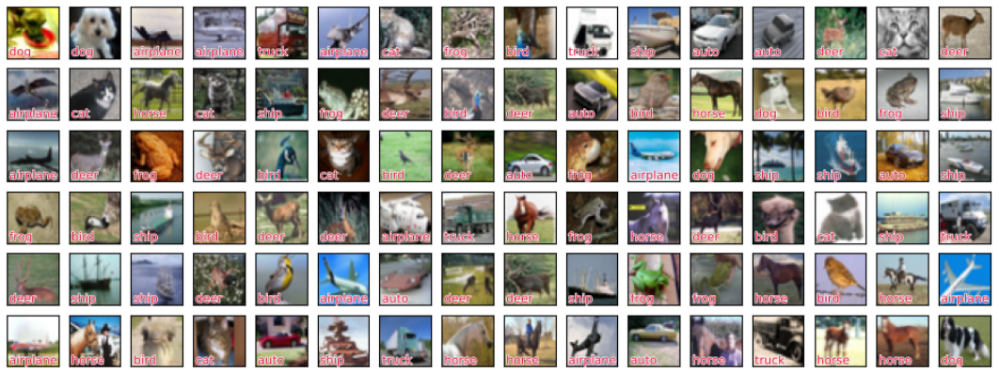

# Data Science Portfolio
---
## Machine Learning

### Predict House Prices (Regression) using XGBoost, Linear Regression, Ridge Regression, Lasso Regression, and Lightgbm using Scikit-learn (Top 13% in Kaggle)

When buying a house, customers usually have considerations about things like the presence of a garage, the number of bedrooms, the number of floors, and the age of the house. On this occasion, we are given The Ames Housing dataset compiled by Dean De Cock and provided by Kaggle. This dataset talks about many variables of houses from the count into its variable area. Our objective is to predict the sales price for each house.

We use many regression algorithms to build the model for this case. From what we worked on, the results stated that The XGBoost makes the best prediction with a score of 0.14363 followed by Ridge Regression with 0.16462, Lasso Regression with 0.18133, and Linear Regression with 0.19303. Improvement still can be made by adding target-encoding to high cardinality variables, applying cross-validation (CV), and deeper EDA.

Top 13% in Kaggle

---
### Predict Spaceship Titanic Passenger Who Got Transported (Classification) using Logistic Regression, Random Forest, KNN, Decision Trees, SVM, Catboost Classifier using Scikit-learn (Top 7% in Kaggle)

In 2912, The Spaceship Titanic was an interstellar passenger liner launched a month ago. With almost 13,000 passengers on board, the vessel set out on its maiden voyage transporting emigrants from our solar system to three newly habitable exoplanets orbiting nearby stars. While rounding Alpha Centauri en route to its first destination—the torrid 55 Cancri E—the unwary Spaceship Titanic collided with a spacetime anomaly hidden within a dust cloud. Sadly, it met a similar fate as its namesake from 1000 years before. Though the ship stayed intact, almost half of the passengers were transported to an alternate dimension!

From this unique case, we have an objective to predict whether a passenger was transported to an alternate dimension during the Spaceship Titanic's collision with the spacetime anomaly. We use many classification algorithms for this binary classification case. From what we worked on, the results stated that the Catboost Classifier makes the best classifier algorithm with 0.80 accuracy on the test set followed by Random Forest with 0.99, SVM with 0.99, Decision Trees with 0.88, KNN with 0.42, Logistic Regression with 0.24.

Top 13% in Kaggle

axaxa.

---
## Deep Learning (Including Computer Vision)

### MNIST Digit Recognizer using VGG16 and ResNet50 with TensorFlow (Top 20% in Kaggle)

This time we are provided MNIST data from Kaggle. MNIST data is collection of 70,000 handwritten digits images. Our goal is to build a model that classify each image of MNIST data to 10 different class or digit (0, 1, 2, 3, 4, 5, 6, 7, 8, and 9). The data is separated between the training and test dataset with the 60:40 proportion. In other to evaluate our model, we need to match our predicted data to the actual data in the Kaggle website.

We want to make prediction models using Convolutional Neural Network (CNN). The MNIST image originally in 28x28 format but the data from kaggle is in flatenned format so we need to do some preprocessing to convert it to the original image dimension.

Top 20% in Kaggle

abcd.

 

 

---
### CIFAR-10 Image Classification using VGG16 and ResNet50 with TensorFlow

CIFAR-10  is an established computer-vision dataset used for object recognition. It is a subset of the 80 million tiny images dataset and consists of 60,000 32x32 color images containing one of 10 object classes, with 6000 images per class. It was collected by Alex Krizhevsky, Vinod Nair, and Geoffrey Hinton. In this case, we will use the 60,000 32x32 color images, 50,000 for the training set and 10,000 for the test set.

Our objective is to build a model that could precisely classify the 10,000 test data. 

absc

 

 

---

© 203 vsve. Powered by Jekyll and the Minimal Theme.

