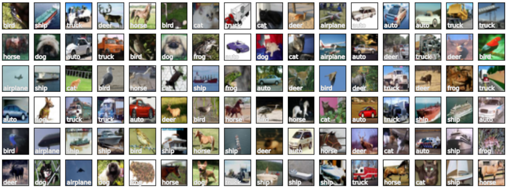

# Portfolio (in maintenance until 18 March 21.00 WIB)
---
## Data Science

### Regression - House Prices

abcd

---
### Classification - Spaceship Titanic

axaxa.

---
## Convolutional Neural Networks (CNN)

### MNIST Digit Recognizer with TensorFlow

abcd.

 

 

---
### CIFAR-10 Image Classification using VGG16 and ResNet50 with TensorFlow

absc

 

 

---

© 203 vsve. Powered by Jekyll and the Minimal Theme.

